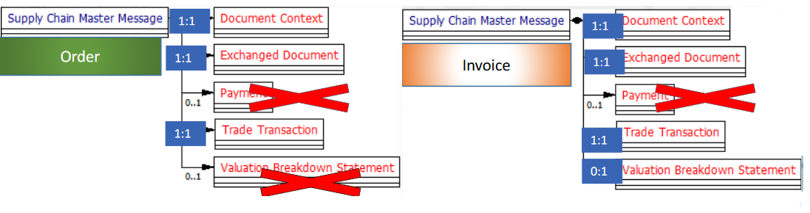

# e-order
development of a jar to read and write [electronic orders](http://fnfe-mpe.org/wp-content/uploads/2021/01/2021-01-15-Release-Order-X-_EN.pdf) conforming to [Order-X](http://fnfe-mpe.org/factur-x/order-x/). 

[Order-X(de)](https://www.ferd-net.de/aktuelles/meldungen/order-x-ein-gemeinsamer-standard-fuer-elektronische-bestellungen-in-deutschland-und-frankreich.html) is new franco german standard for electronic orders equivalent to to [Factur-X](http://fnfe-mpe.org/factur-x/factur-x_en/). It is based on [UN/CEFACT](https://en.wikipedia.org/wiki/UN/CEFACT) Supply Chain Reference Data Model ([SCRDM](https://www.unescap.org/sites/default/files/Session%202_SCRDM_UNCEFACT.pdf)).

[SCRDM](https://service.unece.org/trade/uncefact/publication/Supply%20Chain%20Management/CrossIndustrySCRDM/SCRDM/HTML/001.htm) contains Cross-Industry-Order (CIO), a xml syntax for e-order. Both CIO and Cross-Industry-Invoice are supply chain messages with similar structure:

Similar because
- CIO schema is based on SCRDM (103) D19A which was published in 2019
- CII however is based on Version (100) [SCRDM 16B](https://unece.org/trade/uncefact/xml-schemas) released in 2016

